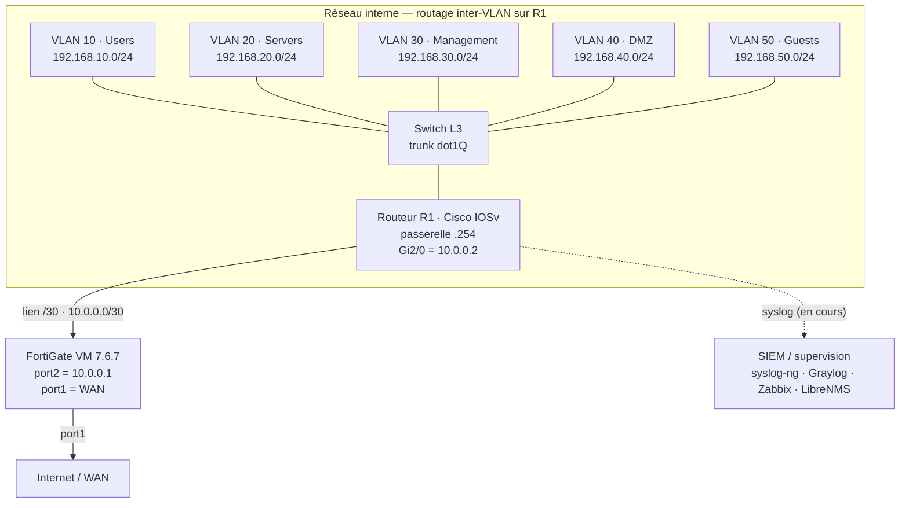

# NOVA_CORP

Labo d'infrastructure d'entreprise monté sur une seule machine, pour pratiquer le réseau, la sécurité FortiGate, l'Active Directory et la supervision dans des conditions proches de la production. Le tout simule une PME d'une vingtaine à une cinquantaine de postes, sous le domaine fictif `novaenterprise.com`.

Ce dépôt rassemble l'architecture, les configurations (nettoyées) et les procédures. Il documente aussi, volontairement, les problèmes rencontrés et la façon dont je les ai diagnostiqués — y compris ceux que je n'ai pas encore résolus.

## Topologie réseau

Cinq VLANs sont portés par les sous-interfaces `dot1Q` de R1 (de `Fa0/0.10` à `Fa0/0.50`). C'est R1 qui assure le routage inter-VLAN et sert de passerelle (`.254`) à chaque segment. Il rejoint le FortiGate par un lien point-à-point en `/30`.

Le FortiGate, lui, ne filtre pas le trafic entre VLANs : il fait office de passerelle Internet. Concrètement, tout le trafic qui sort vers le WAN passe par lui (entrée sur `port2`, sortie sur `port1`), mais le trafic interne d'un VLAN à l'autre ne quitte jamais R1.



Le flux syslog `R1 → FortiGate → SIEM` n'est pas encore fonctionnel : les paquets arrivent bien sur `port2` mais ne franchissent pas le moteur de politique. Le diagnostic complet est dans [docs/known-issues.md](docs/known-issues.md).

Toutes les adresses de ce dépôt sont en RFC 1918 (plages privées). Les credentials, clés et configs brutes sont exclus par le `.gitignore`.

## Plan d'adressage

Les cinq VLANs vivent chacun dans un `/24` dédié, tous avec R1 en passerelle sur `.254` :

- VLAN 10 (Users) — `192.168.10.0/24`, sous-interface `Fa0/0.10`
- VLAN 20 (Servers) — `192.168.20.0/24`, `Fa0/0.20`
- VLAN 30 (Management) — `192.168.30.0/24`, `Fa0/0.30`
- VLAN 40 (DMZ) — `192.168.40.0/24`, `Fa0/0.40`
- VLAN 50 (Guests) — `192.168.50.0/24`, `Fa0/0.50`

Le lien entre R1 et le FortiGate est un `/30` : `10.0.0.2` côté routeur (`Gi2/0`), `10.0.0.1` côté pare-feu (`port2`).

## Ce qu'il y a dans le labo

Côté réseau, deux équipements Cisco IOSv émulés sous GNS3 : R1 (routage inter-VLAN, trunk dot1Q) et un switch L3. La frontière Internet est tenue par un FortiGate VM 7.6.7, qui gère les politiques et le NAT en sortie.

Côté systèmes, un domaine Active Directory (`novaenterprise.com`) avec un poste Windows 11 (PROD01) joint au domaine.

Côté observabilité, une chaîne complète tourne sur des VMs Ubuntu 22.04 : syslog-ng pour collecter et router les logs, Graylog adossé à OpenSearch pour l'indexation et la recherche (le tout en Docker), Zabbix pour les métriques et l'alerting, LibreNMS pour la cartographie SNMP.

## Où en est le projet

La partie réseau tourne : routage inter-VLAN, commutation, segmentation FortiGate avec ses groupes d'adresses. L'Active Directory et le poste PROD01 sont opérationnels, tout comme la stack SIEM (Graylog/OpenSearch), Zabbix et LibreNMS.

Deux chantiers restent ouverts. Le premier, prioritaire, est le routage syslog jusqu'au SIEM, bloqué au niveau du FortiGate. Le second est la documentation des procédures de déploiement, encore partielle.

## Environnement

Tout tourne sur une seule machine Windows via VMware Workstation Pro (version gratuite). GNS3 héberge R1, le switch L3 et le FortiGate ; des VMs Ubuntu portent les services de supervision, sur un réseau séparé du LAN de production.

À noter : le nœud Cloud de GNS3 souffre d'un bug de bridge asymétrique, que je contourne en passant par le lien interne `10.0.0.0/30` de R1. C'est détaillé dans le journal des problèmes.

## Organisation du dépôt

```
NOVA_CORP/
├── README.md
├── docs/
│   ├── architecture.md    architecture détaillée et flux de trafic
│   ├── known-issues.md    problèmes rencontrés et diagnostics
│   └── topology.svg        schéma réseau
├── network/               configs Cisco IOSv (nettoyées)
├── fortigate/             politiques FortiGate (nettoyées)
├── ad/                    scripts PowerShell et GPO (sans credentials)
└── monitoring/            configs syslog-ng, Zabbix, LibreNMS, SIEM
```

## Une note sur l'approche

Ce labo n'est pas figé — c'est un environnement sur lequel je continue de travailler. J'y documente autant ce qui marche que ce qui coince, parce que la démarche de diagnostic a autant de valeur que la config finale. Le problème syslog en est un bon exemple : il est toujours ouvert, mais tout le raisonnement qui a permis de l'isoler est écrit noir sur blanc.

## Licence

Projet personnel, sous licence MIT. Les configurations sont volontairement nettoyées et ne sont pas destinées à un usage direct en production. Aucune donnée réelle ni adresse publique n'est exposée.
"# Nova-corp-network-lab" 
