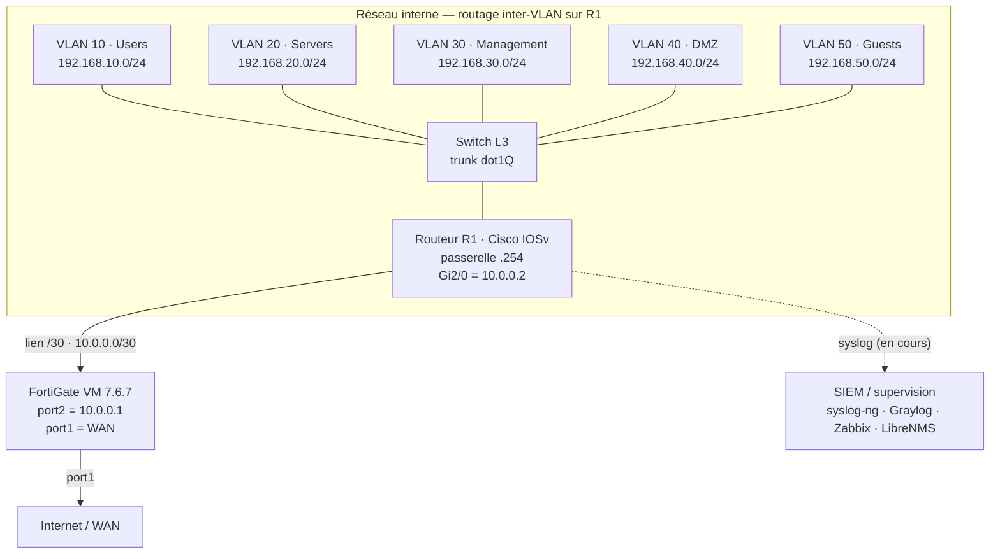

# NOVA_CORP — Lab réseau d'entreprise simulée

> **Statut du projet :** En développement actif | Infrastructure de base opérationnel | Deux bugs documentés en cours de résolution

Simulation d'une PME de 20 à 50 employés, déployée sur une seule machine physique (16 Go RAM) sous VMware Workstation Pro. Le lab sert à la fois de terrain de pratique pour les certifications (CCNA, Security+, FCP FortiGate) et de portfolio technique démontrant des compétences en architecture réseau, sécurité périmétrique, supervision et résolution d'incidents complexes.

---

## 📊 Statut rapide

| Composant | État |
|---|---|
| Switch L3 — VLANs, trunks, ACLs, SNMP | ✅ Opérationnel |
| Routeur R1 — inter-VLAN, NTP, SNMP, SSH, syslog | ✅ Opérationnel |
| FortiGate VM 7.6.7 — 3 policies condensées | ✅ Opérationnel |
| syslog-ng Docker | ✅ Déployé |
| Graylog + OpenSearch Docker | ✅ Déployé |
| Zabbix + LibreNMS | ✅ Opérationnels |
| Active Directory (novaenterprise.com) | ✅ Opérationnel |
| Bug A — Asymmetric bridge GNS3/ubridge | 🔶 Workaround actif |
| Bug B — Syslog R1 → FortiGate → SIEM | 🔴 Non résolu |
| NetPilot AI — collecteur Netmiko | 🚧 En développement |

---

## 🏗 Topologie



---

## 📁 Structure du dépôt

```
nova-corp-network-lab/
├── README.md                           ← Ce fichier
├── docs/
│   ├── architecture.md                 ← Choix d'architecture détaillés
│   ├── known-issues.md                 ← Bug A et Bug B — diagnostics
│   ├── journal-deploiement.md          ← Chronologie complète (9 phases)
│   └── roadmap.md                      ← Ce qui reste à faire
├── network/
│   ├── R1.conf                         ← Config Cisco IOSv (sanitisée)
│   └── switch-L3.conf                  ← Config switch L3 (sanitisée)
├── fortigate/
│   └── policies.conf                   ← Policies FortiGate (sanitisées)
├── supervision/
│   └── docker-compose.yml              ← Stack Graylog/OpenSearch/Zabbix/LibreNMS
├── netpilot/
│   └── init_indices.py                 ← Initialisation index OpenSearch (11 assertions OK)
└── mnt/user-data/outputs/              ← Configs préparées
    └── fortigate/
```

---

## 🚀 Quick Start

### Prérequis

- VMware Workstation Pro (version gratuite OK)
- GNS3 2.2.59+ avec GNS3 VM
- 16 Go RAM minimum (recommandé)
- Appliances GNS3 : Cisco IOSv, Cisco IOSvL2, FortiGate-VM64-KVM 7.6.7

### Déploiement rapide

1. **Lancer GNS3** et importer les configurations Cisco depuis `network/`
2. **Déployer FortiGate** et injecter `fortigate/policies.conf`
3. **Démarrer la stack supervision** sur Ubuntu VM :
   ```bash
   cd supervision/
   docker-compose up -d
   ```
4. **Initialiser les index OpenSearch** :
   ```bash
   pip install opensearch-py sentence-transformers
   python netpilot/init_indices.py
   ```
5. **Accéder aux interfaces** :
   - Graylog : `http://192.168.60.x:9000`
   - Zabbix : `http://192.168.60.x:8080`
   - LibreNMS : `http://192.168.60.x:8081`

---

## 📚 Documentation

Pour une compréhension complète, consulte dans cet ordre :

1. **[architecture.md](docs/architecture.md)** — Vue d'ensemble, VLANs, plans d'adressage, choix architecturaux
2. **[journal-deploiement.md](docs/journal-deploiement.md)** — Comment tout a été construit, phase par phase (9 phases documentées)
3. **[known-issues.md](docs/known-issues.md)** — Bug A (workaround actif) et Bug B (non résolu), diagnostics complets
4. **[roadmap.md](docs/roadmap.md)** — Priorités suivantes et backlog

---

## 🔧 Stack technologique

| Composant | Rôle | Déploiement |
|---|---|---|
| Cisco IOSv | Routeur R1 (inter-VLAN) | GNS3 |
| Cisco IOSvL2 | Switch L3 (5 VLANs) | GNS3 |
| FortiGate-VM64-KVM 7.6.7 | Pare-feu périmétrique + NAT | GNS3 |
| syslog-ng | Collecte logs réseau | Docker — GNS3 VM |
| Graylog + OpenSearch | SIEM et indexation | Docker — Ubuntu VM |
| Zabbix | Supervision SNMP/agent | Docker — Ubuntu VM |
| LibreNMS | Découverte réseau + graphes | Docker — Ubuntu VM |
| Windows Server 2022 | Active Directory | VMware |
| Windows 11 (PROD01) | Poste client test | VMware |

---

## ⚠️ Problèmes connus

### Bug A — Asymmetric bridge (GNS3 Cloud node)
**Sévérité :** Moyen | **Statut :** Workaround actif

Les réponses ARP de l'extérieur ne remontent pas via le Cloud node GNS3 (ubridge asymétrie). **Workaround :** tout passe via le lien interne `10.0.0.0/30` (R1 ↔ FortiGate), la supervision via VMnet2 direct.

👉 Détails complets : [known-issues.md → Bug A](docs/known-issues.md#bug-a--)

### Bug B — Syslog R1 → FortiGate → SIEM
**Sévérité :** Élevé | **Statut :** Non résolu — piste identifiée

Les paquets syslog arrivent sur `port2` du FortiGate mais ne ressortent pas. Le drop est interne (avant le moteur de policy, probablement RPF/local-in handler).

**Piste de résolution :** changer la destination syslog sur R1 pour pointer directement vers syslog-ng (192.168.66.128:514) au lieu de l'IP du FortiGate.

👉 Détails complets : [known-issues.md → Bug B](docs/known-issues.md#bug-b--)

---

## 🎯 Certifications ciblées

- Cisco CCNA (concepts appliqués dans le lab)
- CompTIA Security+ ✅ (obtenu)
- Microsoft MD-102 ✅ (obtenu)
- **FCP FortiGate 7.6 Administrator (NSE4)** — en préparation
- GCIH — planifié

---

## 🔐 Sécurité et bonnes pratiques

- ✅ Toutes les adresses en RFC 1918 (192.168.x.x, 10.x.x.x)
- ✅ Credentials et clés SSH exclus du dépôt (`.gitignore`)
- ✅ Configurations sanitisées (placeholders pour secrets)
- ✅ Aucune donnée réelle ni adresse publique exposée
- ✅ Licence MIT

---

## 📝 Notes sur l'approche

Ce labo n'est pas figé. J'y documente autant **ce qui marche** que **ce qui coince**, car le diagnostic a une valeur pédagogique. Bug B en est l'exemple : ouvert mais entièrement diagnostiqué, piste de résolution claire (non testée).

Chaque phase est documentée :
- Décisions architecturales et **pourquoi**
- Incidents rencontrés et leur résolution
- Choix de trade-offs (ex : 3 policies FortiGate faute de licence pour 6)

---

## 📊 Métriques du projet

- **9 phases de déploiement** documentées
- **2 bugs** identifiés et diagnostiqués (1 résolu par workaround, 1 en investigation)
- **4 services** de supervision opérationnels (syslog-ng, Graylog, Zabbix, LibreNMS)
- **5 VLANs** segmentés et routés
- **3 policies** FortiGate condensées (limite évaluation)
- **11 assertions** validées (init_indices.py OpenSearch)

---

## 👨‍💻 À propos

Projet personnel de portfolio. Compétences démontrées :

- Architecture réseau (VLAN, routage inter-VLAN, segmentation)
- Sécurité périmétrique (FortiGate, politiques, NAT)
- Supervision (SIEM, SNMP, syslog, ELK stack)
- Dépannage et diagnostics avancés (tcpdump, FortiOS debug flow)
- Infrastructure as Code (Docker, Netplan, GNS3)
- Documentation technique et rédaction d'incidents

---

## 📄 Licence

Projet sous **licence MIT**. Les configurations sont volontairement nettoyées et ne sont pas destinées à un usage direct en production.

---

*Cédric Tanekeu Somkwe | Ottawa-Gatineau*

*CCNA · Security+ · MD-102 · GNS3 · FortiGate · Cisco IOS · Docker · Python*
